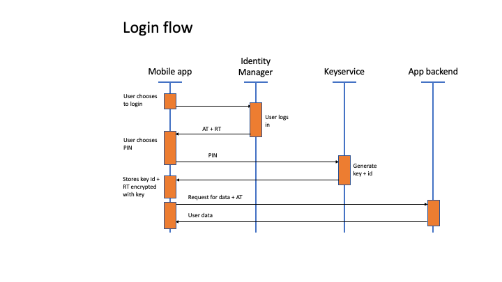
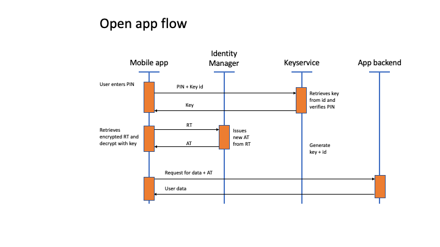

# Trifork Identity Manager Technical Documentation

## Keyservice

### Purpose
The purpose of the Keyservice in TIM is to ensure that all verification of simple PINs or passwords is performed online. This means that an offline brute-force attack on these PINs or passwords is not possible.

The primary usecase for this feature is to protect the refresh token (RT) stored on mobile devices. Depending on the setup of realm and client in the Identity Manager, the RT is a bearer token representing a long term session. This means that the any adversary getting access to a users RT, will be able to get an access token which in turn gives access to the protected services/ data. 

Typically the RT has a long lifetime (e.g. 6 months), and thereby allowing the user to access data without performing a new login each time the app is opened. Usually you would want the app to be protected using biometry or a PIN code on startup. By using the TIM Keyservice, this can be done without leaving any low entropy PINs or passwords on the device that could be brute-forced.

### Usage during login with Identity Manager
After a user has performed a login, the app has to store the issued RT securely on the device. On modern mobile phones, this can be done direcly in e.g. the iOS Keychain protected by FaceID. If the user for some reason does not want to use biometri to open the app, the protection is more difficult. One option could be to derive an encryption key from a PIN or password. This solution would be vulnerable to a brute force guessing attack if an adversary gets the encrypted RT stored on the phone. Using the TIM Keyservice to issue and protected the encryption keys for RT's ensures that PINs or passwords are verified online, and hence not easily guessed.

In pratice the flow when performing initial login is as follows:

1. User login and AT/RT is issued.
2. User chooses PIN
3. App requests encryption key + key id from TIM Keyservice
4. App encrypts the RT using the encryption key, and stores the encrypted RT + key id on the device.

### Usage when app is opened again
When the user already have logged in, and a long term session is established in form of a RT, the Keyservice is used to decrypt this RT stored on the device. The flow is as follows:

1. App prompts user for PIN
2. App request the key from Keyservice using the key id + PIN
3. App decrypts the stored RT
4. App calls Identity Manager to get AT from the RT

### Biometrics
If the user chooses to protect access to the app with biometric means (e.g. FaceID), the app basically stores the PIN on the mobile device protected by biometry. On iOS this would mean that the PIN is stored in the Keychain protected by FaceID.

The TIM Keyservice does issues what is called "Long PIN" when a new encryption key is requested. This Long PIN is autogenerated by the Keyservice, and can be used to request the key again in the same way as the user-chosen PIN.

The purpose of this Long PIN is to avoid storing a user chosen PIN in the Keychain. Instead only the autogenerated Long PIN is stored when using biometic authentication. Users have a tendency to re-use PINs from e.g. creditcards, and hence it is preferrable to avoid storing any user-chosen PIN on the device.